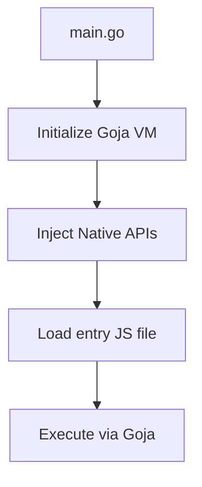

# nodeGO

A lightweight, custom JavaScript runtime built in Go using the [Goja](https://github.com/dop251/goja) JS engine—designed to emulate core features of Node.js for learning and experimentation.

---

## 🚀 Overview

**nodeGO** is a Node.js-inspired JavaScript runtime that mimics essential features such as synchronous file system access, timers, a CommonJS-style module system, and a minimal `process` object. It's designed to deepen understanding of JS runtimes, event loops, and native bindings by re-implementing these behaviors in Go.

---

## 🧱 Architecture

- **Goja VM**: Executes JavaScript.
- **Runtime Layer**: Written in Go, exposes native APIs to JS.
- **Core Bindings**: Implemented natively (console, timers, fs, etc.).
- **Module Loader**: Loads and executes `.js` files via a custom `require()`.



---

## ✅ Implemented Features

### 📦 Console

- `console.log(msg)`
- `console.error(msg)`
- `console.warn(msg)`

### ⏱️ Timers & Task Queues

- `setTimeout(fn, delay)`
- `setInterval(fn, delay)`
- `setImmediate(fn)`
- `queueMicrotask(fn)`
- `process.nextTick(fn)`

### 📁 File System (Sync)

- `fs.readFileSync(path)`
- `fs.writeFileSync(path, data)`

### 📦 Module System

- `require(path)` – supports `.js` files
- Loads and evaluates each module in isolated scope

### 🧠 Process Object

- `process.cwd()`
- `process.argv`
- `process.env`
- `process.exit(code)`

---

## 📂 Project Structure

```bash
nodeGO/
├── main.go              # Entry point
├── runtime/
│   ├── runtime.go       # Core VM & event loop setup
│   ├── console.go       # console APIs
│   ├── timers.go        # Timers & task queues
│   ├── process.go       # process object
│   ├── module.go        # require() implementation
│   └── modules/
│       └── fs.go        # File system bindings
```

---

## 🛠 Usage

### 1. Compile

```bash
go build -o nodego main.go
```

### 2. Run JavaScript File

```bash
./nodego examples/app.js arg1 arg2
```

### 3. Sample `app.js`

```js
console.log('Running:', process.argv);
console.log('CWD:', process.cwd());
console.log('User:', process.env.USER);

const fs = require('./test.js');
fs.hello();

setTimeout(() => {
  console.log('Timeout triggered');
}, 1000);
```

---

## ⚠️ Limitations

- No support for `import/export` (ESM)
- No asynchronous FS
- No HTTP or network APIs
- No built-in `Buffer`, `path`, `crypto`, etc.
- No npm support or module cache
- `clearTimeout` / `clearInterval` not implemented yet

---

## 🛤️ Planned Features

- `EventEmitter` core implementation
- Stream API basics
- Simple HTTP server
- `clearTimeout()` and `clearInterval()`
- Module caching
- Global error handling (`uncaughtException`)
- CLI REPL

---

## Goal

This project is not intended to replace Node.js but to **understand how it works internally** by rebuilding its components from the ground up.
